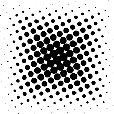
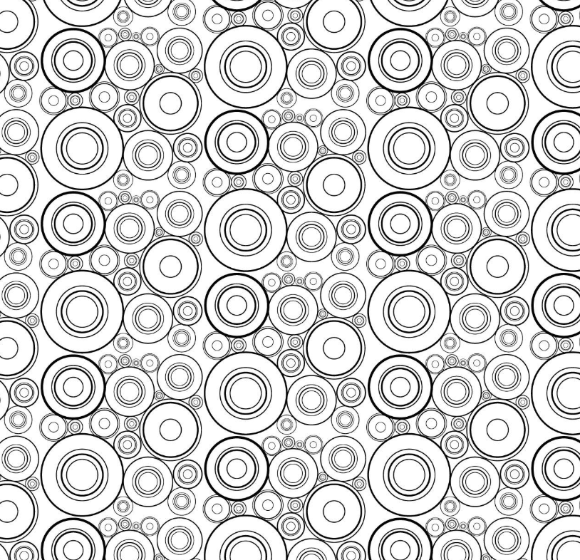

# Quiz 8 – Design Research for Major Assignment

## Part 1: Imaging Technique Inspiration

The animation in this [Pinterest video](https://www.pinterest.com/pin/790170697161258324/) showcases multiple white stroke circles that change size randomly over time, creating a soft, breathing-like motion across the canvas. This kind of ambient visual field is both calming and engaging. I want to recreate this effect using techniques taught in class, such as `random()`, `frameCount`, and `sin()` to animate the scale of circles independently. To introduce interactivity, I plan to implement a toggle mode: when the user presses the spacebar, the animation will switch from random behavior to interactive mode, where the circle closest to the mouse pointer enlarges, and nearby circles react with a ripple effect. This approach balances passive animation with active user engagement.

### Reference Screenshots

  

## Part 2: Coding Technique Exploration

To achieve this animation, I explored a p5.js sketch that demonstrates smooth random resizing of multiple circles over time. This technique can be implemented using `random()`, `sin()`, and `frameCount` to create independent scaling for each circle. To add interactivity, we can use `dist()` and `map()` to calculate size changes based on the cursor’s proximity, and detect the spacebar using `keyPressed()`. This sketch provides a great foundation for both ambient animation and user-triggered interaction, using logic structures and animation tools taught in class.

Link to example code: [https://editor.p5js.org/SomeshSahoo/sketches/CepscWHM1](https://editor.p5js.org/SomeshSahoo/sketches/CepscWHM1)
